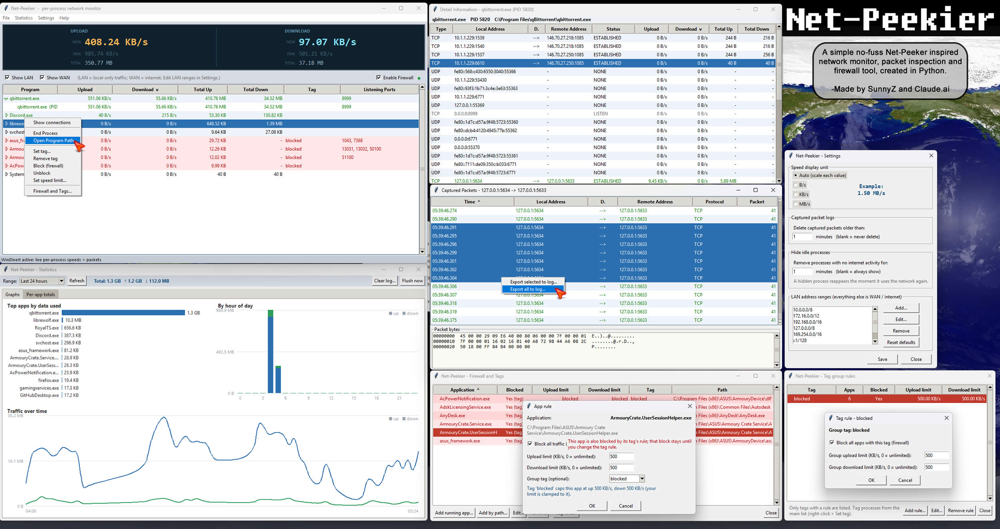

# Net-Peekier
##### v1.0.21

A small, dependency-light per-process network monitor inspired by the old
**NetPeeker** — built in Python with a Tkinter GUI. It shows live upload/
download speeds, the processes using your network, their listening ports,
per-process live connections, real-time packet capture with a hex dump, and
firewall blocking / speed limiting.

It deliberately keeps NetPeeker's simple structure:

```
Dashboard (up/down now + peak + total)
   └─ Application list  (svchost.exe ▸ expands to its PIDs)   [sortable headers]
        └─ double-click ▸ Connections (Detail Information)    [sortable headers]
             └─ double-click ▸ Captured Packets (+ hex dump)  [sortable headers]
   Right-click a process ▸ Block / Unblock / Set tag / Set speed limit / ...
   Statistics ▸ traffic graphs + per-app totals
   Settings ▸ Firewall and Tags  (the firewall/limits/tags manager)
            ▸ Preferences        (speed unit, purge, idle-hide, LAN ranges)
```


## Quick start

```bash
pip install -r requirements.txt
python run.py
```

On **Windows**, launch from an **Administrator** terminal so you can see every
process's connections and so WinDivert can load.

## Two operating modes

The app auto-detects what's available and tells you in the status bar.

| Capability | psutil-only (no driver) | + WinDivert (`pip install pydivert`) |
|---|---|---|
| Process list, connections, statuses | ✅ | ✅ |
| Listening ports per app | ✅ | ✅ |
| Dashboard up/down speed (now + peak) | ✅ (system-wide) | ✅ (sum of processes) |
| Dashboard total sent / received | ✅ (system-wide, since start) | ✅ |
| **Per-process** up/down speed | ❌ | ✅ |
| **Per-process** total sent / received | ❌ | ✅ |
| Live packet capture + hex view | ❌ | ✅ |
| Block app (Windows Firewall) | ✅ (needs admin) | ✅ |
| Speed limit (throttle) | recorded only | ✅ enforced |
| Tag groups with shared block / limit | recorded only | ✅ enforced |

### Why WinDivert?

Windows has **no userland API for per-process bandwidth**. `psutil` exposes
connections and ports, but byte counters are only system-wide. NetPeeker solved
this with its own kernel driver; the modern, signed, Python-drivable equivalent
is **WinDivert** (via the `pydivert` package). Net-Peekier uses it the safe
way:

- a **SNIFF** handle (read-only) measures traffic and captures packets — it can
  never break your connectivity;
- a separate **enforcer** handle opens *only while* a **speed limit** is active,
  putting Python in the data path solely to throttle. It is **fail-open**: any
  error reinjects the packet, so it can never take you offline. Crucially, the
  enforcer's WinDivert filter is **scoped to just the limited apps' current
  local ports**, rebuilt as those ports change. Everything else stays on the
  kernel fast path — so limiting one app never diverts (or stalls) anyone
  else's traffic. When a limited app has no live connections, the enforcer
  diverts nothing at all.

**Blocking is Windows Firewall only** (`netsh advfirewall`). It is selective and
kernel-enforced, so a block is persistent and never sits in your packet path.
This is deliberate: routing *all* traffic through a userspace loop just to drop
one app's packets would stall every other connection — so blocking never
touches the enforcer.

**Safety:** a firewall rule with no valid program path would block *all*
traffic and persist after the app closes, so every block is validated first —
Net-Peekier refuses to create a rule from anything that isn't a concrete,
absolute path to an `.exe`. Empty or unresolved paths (which can happen for
protected system processes) are skipped, never turned into a rule. If blocking
ever leaves you stuck, untick **Enable Firewall** (top bar): it removes every
rule this app created (only those — it matches on our own name prefix) and lets
traffic flow, while keeping your block configuration so you can switch it back
on later.

## System stats panel

The dashboard's third column (right of Upload / Download) shows live **system
stats** — CPU, GPU and RAM, each with **load**, **clock** and **temperature**.

What's available depends on what's installed:

- **Load and clock** come from `psutil` (already required), so CPU load + clock
  and RAM used % work out of the box. GPU load/clock need an optional sensor
  library (below).
- **Temperatures** are not exposed by `psutil` on Windows. To show CPU/GPU/RAM
  temps, install the optional **LibreHardwareMonitor** layer:
  `pip install HardwareMonitor` (pulls in `pythonnet`; needs **.NET** and the
  app run **as Administrator**). Many CPU/motherboard sensors additionally need
  the **PawnIO** kernel driver — install it once with `winget install PawnIO`
  (reboot if prompted); without it CPU package temperature often won't appear.
  NVIDIA GPUs can alternatively use `pip install nvidia-ml-py` for GPU
  temp/clock/load.
- Anything unavailable shows a dash (`--`) and never blocks the app — the same
  graceful-degradation approach as WinDivert. **RAM clock and RAM temperature
  are usually unavailable** — most boards expose no live memory-clock sensor,
  and even with DDR5/DDR4 thermal-sensor modules, multi-stick kits frequently
  don't surface a per-module temperature, so these stay dashes no matter which
  library you use. The app prefers a correctly-named package/Tctl CPU sensor and
  ignores 0 °C placeholder readings, so CPU temp shows the real value (or a
  dash) rather than 0.

The numbers are polled on a background thread (so slow sensor reads never stall
the UI) and the dashboard values are fixed-width, so they don't shuffle the
layout as they change.

## Lockdown Mode (default-deny)

To the left of Enable Firewall is a **Lockdown Mode** checkbox. When on, only
programs on the **allow-list** may reach the internet; any other process that
makes a WAN connection is blocked and a prompt appears asking what to do:

- **Allow for N minutes** — temporary pass (the minutes value is remembered
  between prompts).
- **Add to allow list** — permanent allow.
- **Block this time** — stays blocked for this session.
- **Add to block list** — permanent block.

You set the allow-list with an **Allow** checkbox in the Firewall and Tags rule
dialog (or right-click ▸ *Allow*), and it works just like Block does — including
**tag allow**: allow a tag and every program carrying it is allowed. Block and
Allow are mutually exclusive. The allow-list, allowed tags and the remembered
minutes are saved to `settings.txt`.

Lockdown needs Enable Firewall on (ticking Lockdown turns it on). LAN-only
traffic is never blocked, so local services keep working. Turning Lockdown off
lifts every block it imposed but keeps your allow-list, and quitting the app
also lifts them — nothing is left blocking traffic behind it.

**How it enforces:** to stay safe, lockdown uses the same per-program Windows
Firewall blocking as everything else (never a global block-everything rule).
That means it's *reactive* — a brand-new connection may succeed for a moment
before the block lands and the prompt appears. It's not a kernel-level
default-deny like the original NetPeeker's driver, but it can't strand your
machine offline.

## Enable Firewall (master switch)

Top-right of the main window, next to Show LAN / Show WAN, is an **Enable
Firewall** checkbox with a status light — **green** when on, **red** when off.
It's on by default and its state is saved to `settings.txt`.

- **On** — your configured blocks are enforced through Windows Firewall.
- **Off** — all Net-Peekier firewall rules are removed so traffic flows freely,
  but your block list and tag-block rules are preserved. Turning it back on
  re-applies them. While off, the main list shows nothing as blocked (because
  nothing is being enforced); the firewall manager still shows what you've
  configured.

## Firewall and Tags (manager)

Open it from **Settings ▸ Firewall and Tags** (or right-click an app).
Rules are organised into **tabs** along the top:

- **All Rules** — every app that has any rule (block, allow, limit or tag).
- **Blocked Rules** / **Allowed Rules** — filtered to just those.
- **IP Rules** — per-IP firewall rules (see below).
- **Tag Rules** — the group-tag block/limit rules (this replaces the old
  separate Tag rules window and its button — it's now a tab here).
- **No Rules** — running apps that currently have no rule, to add one quickly.

The app tabs share one table — blocked state, allow state, limits, tag and path
— independent of whether the app is currently running.

- **Add running app...** — pick from processes that currently have network
  activity (only ones with a resolvable executable path can be managed).
- **Add by path...** — browse to any `.exe`.
- **Edit...** (or double-click a row) — a dialog with *Block* / *Allow*
  checkboxes, *Upload/Download limit* fields in KB/s (0 = unlimited), and a
  *Tag* field.
- **Remove** — clears the block, limit and tag for that app.

### Per-IP rules

A per-IP rule scopes a firewall rule to one program **and** a remote IP, range
or subnet, optionally narrowed to specific ports and a protocol. Add them on the
**IP Rules** tab (**Add IP rule...**), or — more conveniently — from a process's
**Detail Information** window: right-click a connection and choose *Allow/Block
this IP:port for this app* (or the all-ports variants). They're saved in
`settings.txt` and re-applied whenever the firewall is (re)enabled.

> **How "allow only X" works.** Windows Firewall evaluates **block before
> allow**, so an allow rule can't punch through a block. Net-Peekier gets the
> result you want by *inverting* it: an **allow** IP-rule is treated as a
> **whitelist** entry — the app is restricted to its allowed endpoints by
> automatically blocking *everything else* (the complement of the allowed
> IPs/ports, IPv4 and IPv6). Add a second allowed endpoint and the complement is
> recomputed across both. A **block** IP-rule is the opposite: an explicit
> per-destination block carved out of an otherwise-open app. Because a strict
> whitelist blocks all other destinations, remember to also allow anything the
> app genuinely needs (e.g. its DNS server). Every generated rule is scoped to
> `program=exe`, so the blast radius is always that one app — never the machine.

The manager updates **live** — any change you make (here, from the main list, or
to a tag) is reflected immediately, so there's no Refresh button to press. On the
main list, blocking or limiting a selected row also updates its highlight at once
(a blocked row's selection turns red without needing to click away and back).

Rules are keyed by **executable path**, so they stick to the app across
restarts rather than to a one-off PID. Blocks are applied through Windows
Firewall (persistent); limits are enforced by the WinDivert throttler while
active. Both need Administrator — the window tells you if a rule couldn't be
applied.

## Tag groups (shared limits)

Assign a **tag** to processes (right-click a process ▸ *Set tag*, or set it in
the firewall manager). The tag field is a drop-down of tags you've already used,
and you can also type a brand-new tag.

Open **Tag rules...** in the firewall manager to block or set an aggregate speed
limit on a whole tag. The list shows **only tags that have a rule** — use *Add
rule...* to pick a tag and give it a block/limit, and *Remove rule* to clear it
(the processes keep their tag; only the group rule goes away).

A tag limit is a **shared budget**: the combined traffic of every app under the
tag can't exceed it. Example: tag three games as `games` and set the tag's
download limit to 2000 KB/s. One game alone uses the full 2000 KB/s; when a
second launches and wants 500 KB/s, the first backs off to ~1500 KB/s so the
group total stays at 2000 KB/s — a single shared token bucket hands tokens to
whichever app asks first.

An app's **own limit is capped by its tag's limit**: you can give a tagged app a
*lower* individual limit, but never a higher one. The app-rule dialog shows the
tag's cap and clamps your entry to it, and the manager marks a limit that comes
purely from the tag with "(tag)".

**Blocking a tag blocks its members.** When a tag has a block rule, every
process carrying that tag is treated as blocked (shown in red), even though the
block lives on the tag rather than on each app.

**Removing a tag from a process** (right-click ▸ *Remove tag*, or clear the tag
field in the manager) drops it from the firewall rules list entirely if it has
no other block or limit.

## Main-list right-click

Right-click a process row for: **Show connections**, **End Process** (terminate,
then force-kill if needed), **Open Program Path** (opens the folder with the
executable highlighted), **Set tag**, **Block / Unblock**, **Set speed limit**,
and the manager.

## Captured packets → log files

In the Captured Packets window, right-click to **Export selected to log** or
**Export all to log**. Each entry records time, direction, protocol, local and
remote address, length and owner PID, followed by the full hex/ASCII dump. Logs
default to the program's own `log/` folder (see Where files live).

## Settings

Open the **Settings** menu (top bar). Settings persist with everything else to
`settings.txt` in the program folder (see Where files live):

- **Speed display unit** — show all rates in Auto (scale each value), B/s, KB/s
  or MB/s. The chosen unit appears in the cells and in the Upload/Download
  column headers on the main and Detail Information pages. A live preview shows
  a sample speed in the selected unit.
- **Captured packet logs** — delete captured packets older than *N* minutes;
  leave blank to never delete. Captured packets are already capped per
  connection, but over a long session the number of tracked connections grows,
  so a purge interval keeps memory in check. The purge runs on the monitor's
  one-second tick and also forgets connections whose buffers empty out.
- **Hide idle processes** — remove a process from the list when it has had no
  internet activity for *N* minutes (blank = always show). A hidden process
  reappears the instant it uses the network again. With WinDivert active,
  "activity" means measured traffic; without it, activity is inferred from the
  process opening or closing connections.
- **LAN address ranges** — the CIDR ranges treated as local. Sensible defaults
  are filled in (private, loopback, link-local, IPv6 ULA/link-local); you can
  Add, Edit, Remove or Reset to defaults. Anything outside these ranges counts
  as WAN (internet) and drives the Show LAN / Show WAN toggles below.

## Show LAN / Show WAN

Two checkboxes above the process list filter what's shown:

- **Show LAN** — processes whose traffic stays inside the configured LAN ranges
  (plus processes with no internet remote at all).
- **Show WAN** — processes talking to at least one internet (non-LAN) address.

Both are on by default (everything shows). Untick **Show WAN** to focus on
purely local activity, or untick **Show LAN** to see only what's reaching the
internet. The ranges that decide LAN vs WAN are edited in Settings.

## Terminated processes

The list self-cleans: when a process exits, it's detected on the next tick and
removed (its cached byte counters are forgotten too), so dead processes never
linger in the list.

## Window placement

Every window — Detail Information, Captured Packets, the firewall/limits and tag
managers, Settings, and all dialogs — opens centered over the main window.

## Statistics

**Statistics** in the menu bar opens a graphs window built from a rolling
activity log. As the tool runs, it appends per-app traffic samples (which app,
bytes up/down, time) to `log/history.jsonl` every 30 seconds. The window shows:

- a **summary** of total data and up/down for the selected range,
- **Top apps by data used** (horizontal bars),
- **By hour of day** (stacked up/down bars across 24 hours),
- **Traffic over time** (up/down lines),
- a **Per-app totals** table with uploaded, downloaded, total and active time.

Pick a range (last hour / 24 hours / 7 days / all time), Refresh, Flush now to
force the latest samples to disk, or Clear log to wipe the history. The charts
are drawn on plain canvases, so no plotting library is needed. Per-app data is
only recorded when WinDivert is active (it needs real per-process byte counts).

## Where files live

Everything Net-Peekier writes stays inside the program folder:

```
<program root>/settings.txt   options, firewall blocks, per-app limits,
                              tags and tag limits  (JSON inside a .txt)
<program root>/log/           exported packet logs
<program root>/log/history.jsonl   rolling activity log for Statistics
```

The **only** things outside this folder are OS-level and not files Net-Peekier
manages: the **Windows Firewall rules** that actually enforce blocks (stored by
Windows, created via `netsh`) and the **WinDivert driver** (a system driver
installed with the `pydivert` package). Both are unavoidable for selective
blocking and throttling.

## Rows, blocking & sorting

Every other row is shaded a very light blue so adjacent rows are easy to tell
apart. **Blocked** processes stand out further: light-red background with red
text, and when you click one it highlights solid red with white text (normal
rows keep the usual blue selection). A block overrides every other rule — a
blocked row shows "blocked" instead of any limit.

A process counts as blocked if it's blocked directly **or** it carries a tag
that has a block rule; tag-blocked apps are marked "Yes (tag)" in the manager.

Every table sorts by clicking a column header; click again to reverse, and an
arrow marks the active column. The chosen order is preserved across the
once-a-second refresh, and in the application list it also orders the PID rows
within each expanded program group.

**Column widths are remembered.** Resize any column and the widths are saved to
`settings.txt` when the window closes, so they're restored next time you open
that window.

**The main window's size and position are remembered too** — resize or move it
and it reopens the same way next run. The Detail Information and Captured Packets
windows now remember their own size as well, so their saved column widths always
match the window they reopen in (no more last column running off the edge). (If
a window ends up off-screen, e.g. after a monitor change, it falls back to a
sensible default size.)

## How packets are attributed to a process

The capture backend reads each packet's local `(ip, port)` and looks up the
owning PID from a connection table it refreshes ~once a second (`psutil`).
Bytes accumulate per-PID and per-connection; once a second those counters are
divided by the elapsed time to produce live speeds.

## Project layout

```
run.py                     entry point  (imports the `netpeekier` package)
settings.txt               created at runtime: all options/rules (JSON in .txt)
log/                       created at runtime: exported packet logs
netpeekier/
  models.py                dataclasses (Packet, Connection, ProcStat, Totals)
  procmap.py               psutil: processes, connections, ports, endpoint→PID
  capture.py               WinDivert sniff + scoped enforcer + NullBackend
  firewall.py              netsh advfirewall block/unblock (validated, safe)
  history.py               rolling activity log + aggregation for stats
  monitor.py               background worker: builds the 1/sec snapshot
  sysstats.py              optional CPU/GPU/RAM load, clock & temperature poller
  ipcalc.py                IP/port complement maths for the allow-only whitelist
  util.py                  speed/byte formatting (unit-aware)
  paths.py                 program-root file locations (settings.txt, log/)
  settings.py              persisted state: options, blocks, limits, tags
  gui/
    main_window.py         dashboard + app list + right-click + menus
    connections_window.py  per-process connections ("Detail Information")
    packets_window.py      captured packets + hex dump + export-to-log
    firewall_window.py     firewall/limits manager + tag-group rules
    stats_window.py        Statistics: traffic graphs + per-app totals
    charts.py              dependency-free canvas charts (bar/line)
    tag_picker.py          tag chooser (drop-down of existing + free input)
    settings_window.py     speed unit, purge, idle-hide, LAN ranges
    winutil.py             centers child windows over the main window
    treesort.py            reusable click-to-sort for every table
    tablestyle.py          row striping, blocked colours, column-width saving
```

## Limitations & honest notes

- **Windows is the target.** psutil parts run on Linux/macOS too (handy for
  development), but WinDivert, `netsh` firewall and per-process speeds are
  Windows-only.
- **Throttling is a token bucket** that drops over-budget packets; TCP backs
  off in response. It's effective but coarser than a kernel QoS shaper. The
  per-packet path is lock-free and very cheap (~1µs/packet, ~700k packets/sec),
  and the enforcer yields the GIL periodically so even throttling an app that
  blasts far above its limit (e.g. a UDP-heavy game) keeps the GUI responsive —
  excess packets simply overflow the driver queue and get dropped there, which
  is the throttle doing its job. UDP can't be made to "back off" the way TCP
  does, so for a hard UDP cap the dropped-overflow behaviour is what enforces
  the limit.
- **Loose port→PID matching:** the throttle attributes packets by local port
  (kept cheap on purpose); if two processes briefly share a local port view
  (rare), attribution falls back to "last seen wins".
- Requires **admin** for full visibility and for firewall/driver operations.
- This is a clean re-implementation of the *idea*; it shares no code with the
  original NetPeeker.

## Cleaning up firewall rules

Rules created by the app are named `NetPeekier block in/out :: <exe>`. Remove
them from inside the app (Firewall ▸ Unblock) or with:

```bash
netsh advfirewall firewall show rule name=all | findstr NetPeekier
```
